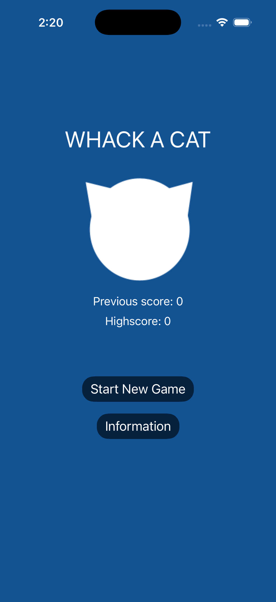
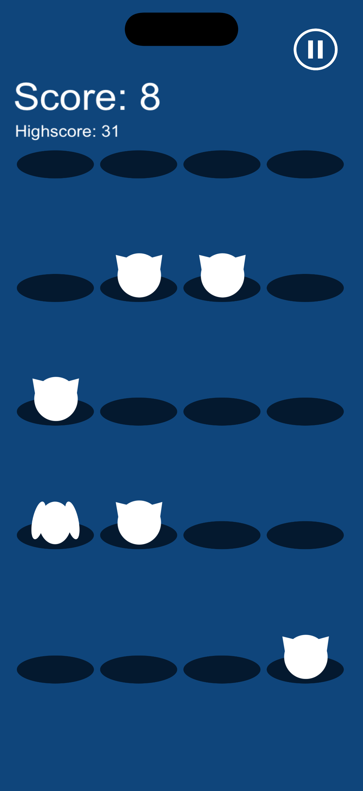
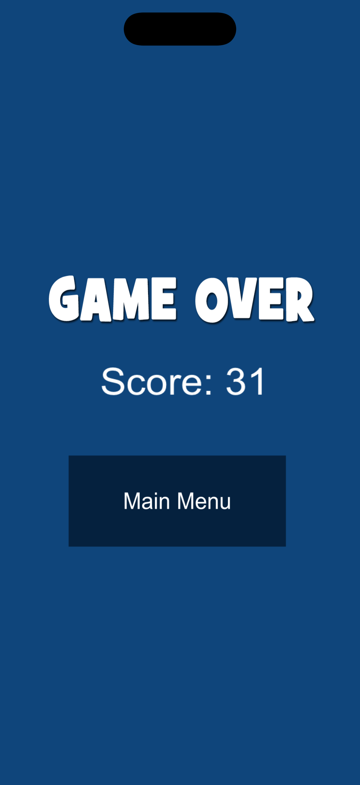
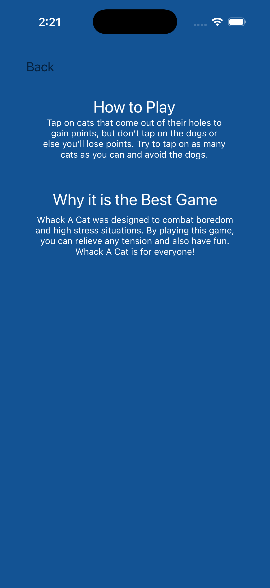

# Whack A Cat

Arcade-style iOS game built with Swift, SpriteKit, and UIKit. Players race through a 30-round run by tapping cats for points, avoiding dogs that cost points, and pushing for a new personal best. The project combines a real-time SpriteKit gameplay loop with storyboard-driven menu flows, persistent score tracking, audio feedback, and pause / game-over state handling.

  

## Overview

Whack A Cat is a small but complete iOS game. It includes a main menu, an information screen, an in-game HUD, a pause / resume flow, an end-of-run state, and score persistence between sessions.

This project showcases:

- Real-time gameplay implemented with SpriteKit
- Reusable gameplay objects built as custom `SKNode` types
- UIKit and SpriteKit integration inside the same iOS app
- Touch handling, random spawn scheduling, and state transitions
- Local persistence with `UserDefaults`
- Basic game feel through art, sound effects, and score feedback

## Demo

  

## Screenshots

  <table>
    <tr>
      <td align="center">
        
      </td>
      <td align="center">
        
      </td>
    </tr>
    <tr>
      <td align="center">
        <strong>Main Menu:</strong> The title screen shows persistent score history and the primary navigation into a new run or the info screen.
      </td>
      <td align="center">
        <strong>Live Gameplay:</strong> The active game has a tap-to-score loop, visible hazards, and the in-run HUD.
      </td>
    </tr>
    <tr>
      <td align="center">
        
      </td>
      <td align="center">
        
      </td>
    </tr>
    <tr>
      <td align="center">
        <strong>Pause Overlay:</strong> The pause state freezes the run and presents quick actions to resume or exit back to the menu.
      </td>
      <td align="center">
        <strong>Game Over:</strong> The game-over screen summarizes the final score and provides a clean path back to the main menu.
      </td>
    </tr>
    <tr>
      <td colspan="2" align="center">
        
      </td>
    </tr>
    <tr>
      <td colspan="2" align="center">
        <strong>Info Screen:</strong> The info screen explains the tap rules and describes the project.
      </td>
    </tr>
  </table>

## Gameplay

- Tap cats to earn `+1` point.
- Tapping a dog costs `-1` point.
- Each run lasts 30 spawn rounds.
- Characters appear across a 20-slot grid with randomized timing and occasional multi-slot waves.
- The app stores both your previous score and your all-time high score locally.

## Implementation Highlights

- `GameScene.swift`: manages the game loop, randomized spawn scheduling, score updates, pause flow, and game-over presentation.
- `WhackSlot.swift`: encapsulates each hole as a reusable gameplay object with `SKCropNode` masking, hit state, and timed show / hide animation.
- `GameViewController.swift`: hosts the SpriteKit scene inside UIKit and handles navigation back to the main menu.
- `MainMenuViewController.swift`: surfaces persisted score data so the player immediately sees progress between sessions.
- Sound effects differentiate successful and penalty taps to reinforce feedback without additional UI clutter.

## Tech Stack

- Swift 5
- SpriteKit
- UIKit + Storyboards
- UserDefaults for local persistence
- Xcode project targeting iOS 15.2+

## Local Setup

1. Clone this repository.
2. Open `WhackACat.xcodeproj` in Xcode.
3. Select the `WhackACat` scheme.
4. Choose an iPhone simulator or physical iOS device.
5. Build and run the app.

There is no separate dependency install step. The project is organized as a plain Xcode app:

- `WhackACat/App`: app entry point and app configuration
- `WhackACat/Controllers`: UIKit view controllers for the menu, info screen, and game host
- `WhackACat/Game`: SpriteKit gameplay code such as `GameScene` and `WhackSlot`
- `WhackACat/Resources`: assets, audio, SpriteKit scene files, and storyboards

## Roadmap

- Replace hardcoded layout values with more adaptive positioning across device sizes
- Add difficulty scaling that ramps more aggressively over the course of a run
- Add lightweight settings such as sound toggles and reset-high-score support
- Add haptics, combo feedback, and leaderboard integration
